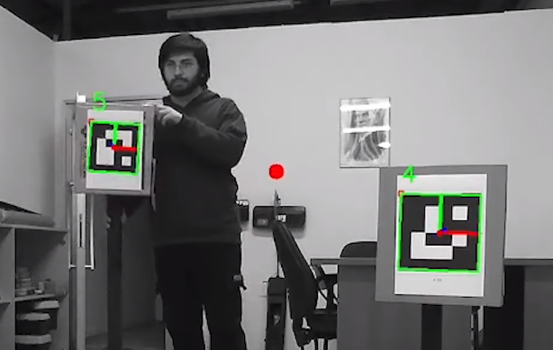

# Description
**Detection of Aruco Markers using OpenCV library.**         
The image information is coming from a ROS Topic published by Zed Stereo Camera.   
For better recognition, Adaptive histogram equalization applied.   
For one marker, the position of the middle point of the ARUCO Marker is published as a ROS Topic.  
For 2 markers, the position of the between point of the markers is published as a ROS Topic.

## GTU Rover
This ROS package was made for use in the [GTU Rover](https://youtu.be/uv-LEvk_AX8?t=205) team's URC competition.  

# Screenshots

**Marker Detection** - You can see the position information of the middle point of the marker on the right side.   
   

  
**Between Point Detection** - You can see the position of the between point of the markers as a red dot. Information of the position is also published as ROS topic  
   

  
**Between Point Detection** - You can see the position of the between point of the markers as a red dot. Information of the position is also published as ROS topic  
