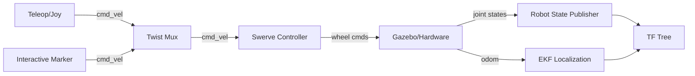
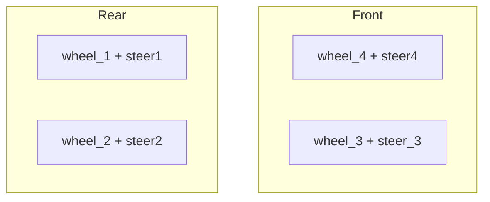
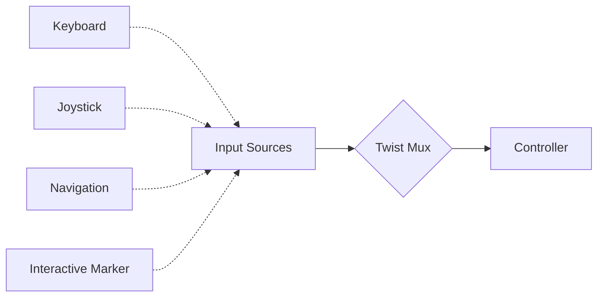
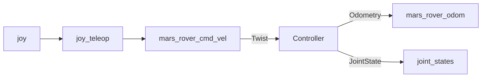
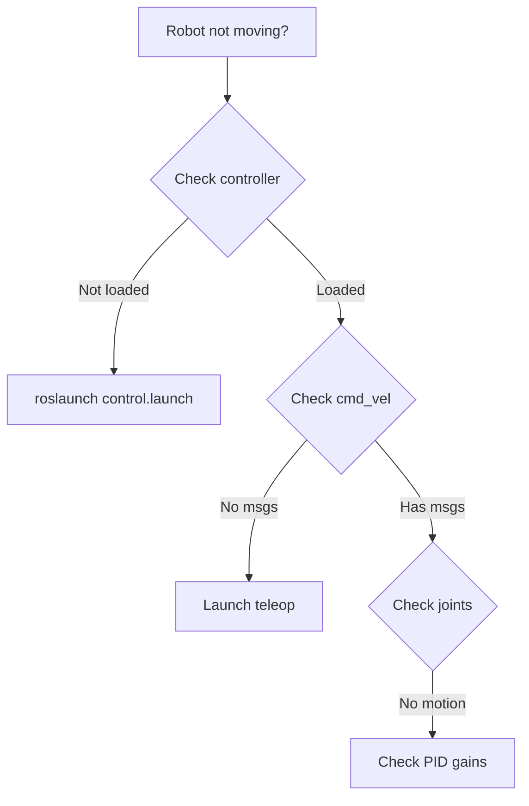

# Mars Rover Control System

Swerve steering controller for 4-wheel independent steering rover in ROS Noetic.

## Quick Start

```bash
# Launch everything
roslaunch rover_control control.launch

# Teleop control
roslaunch rover_control teleop.launch
```
## Demo Video

[](video.webm)

> Click the thumbnail to view the demo video of the Mars Rover Control System in action.

## System Architecture



## Controller Configuration

**File:** `config/control_swerve.yaml`

### Key Parameters

| Parameter | Value | Description |
|-----------|-------|-------------|
| `wheel_separation_width` | 0.591 m | Left-right wheel spacing |
| `wheel_separation_length` | 0.853 m | Front-rear wheel spacing |
| `wheel_radius` | 0.11 m | Wheel radius |
| `max_velocity` | 1.5 m/s | Maximum linear speed |
| `max_angular_velocity` | 2.0 rad/s | Maximum rotation speed |

### Joint Mapping



## Control Modes



### Priority (Highest to Lowest)

1. **Joystick** - Direct manual control
2. **Keyboard** - Teleop fallback
3. **Interactive Marker** - RViz control
4. **Navigation** - Autonomous commands

## Teleop Keys

```
   u    i    o
   j    k    l     i/,: forward/back
   m    ,    .     j/l: rotate left/right
                   k: stop
Speed: q/z (linear), w/x (angular)
```

## Topics



### Main Topics

- **Input:** `/mars_rover/cmd_vel` (geometry_msgs/Twist)
- **Output:** `/mars_rover/odom` (nav_msgs/Odometry)
- **State:** `/joint_states` (sensor_msgs/JointState)

## Localization

```mermaid
graph TD
    A[Wheel Odometry] --> B[EKF Local]
    C[IMU] --> B
    B --> D[/odometry/filtered/local]
    
    E[GPS] --> F[Navsat Transform]
    F --> G[EKF Global]
    D --> G
    G --> H[/odometry/filtered/global]
```

**Config:** `config/localization.yaml`, `config/gps_localization.yaml`

## PID Tuning

### Steering Joints (High Response)
```yaml
p: 100.0  # Proportional gain
i: 0.1    # Integral gain (slow correction)
d: 10.0   # Derivative gain (damping)
```

### Drive Wheels (Smooth Motion)
```yaml
p: 10.0   # Lower for smooth acceleration
i: 0.1    # Minimal windup
d: 0.0    # No damping needed
```

## Troubleshooting



### Common Issues

| Issue | Check | Solution |
|-------|-------|----------|
| No movement | `rostopic echo /mars_rover/cmd_vel` | Launch teleop |
| Wheels spinning | `rostopic echo /joint_states` | Check controller loaded |
| Steering not responding | PID gains | Increase P gain |
| Oscillation | Overshoot | Increase D gain |

## Quick Commands

```bash
# Check status
rosrun controller_manager controller_manager list

# Monitor odometry
rostopic echo /mars_rover/odom

# Test movement
rostopic pub /mars_rover/cmd_vel geometry_msgs/Twist \
  '{linear: {x: 0.5}, angular: {z: 0.0}}'

# View transforms
rosrun tf view_frames
rosrun rqt_tf_tree rqt_tf_tree
```

## Files

```
rover_control/
├── config/
│   ├── control_swerve.yaml    # Main controller config
│   ├── localization.yaml      # EKF local
│   ├── gps_localization.yaml  # EKF global
│   └── twist_mux.yaml         # Input priorities
├── launch/
│   ├── control.launch         # Controllers + localization
│   └── teleop.launch          # Keyboard/joystick control
└── scripts/
    └── teleop_mars_rover.py   # Keyboard teleop node
```

## Performance Specs

| Metric | Value |
|--------|-------|
| Update Rate | 50 Hz |
| Max Linear Velocity | 1.5 m/s |
| Max Angular Velocity | 2.0 rad/s |
| Steering Range | ±90° |
| Acceleration Limit | 1.0 m/s² |

---

**Note:** Adjust `wheel_separation_*` and `wheel_radius` in config