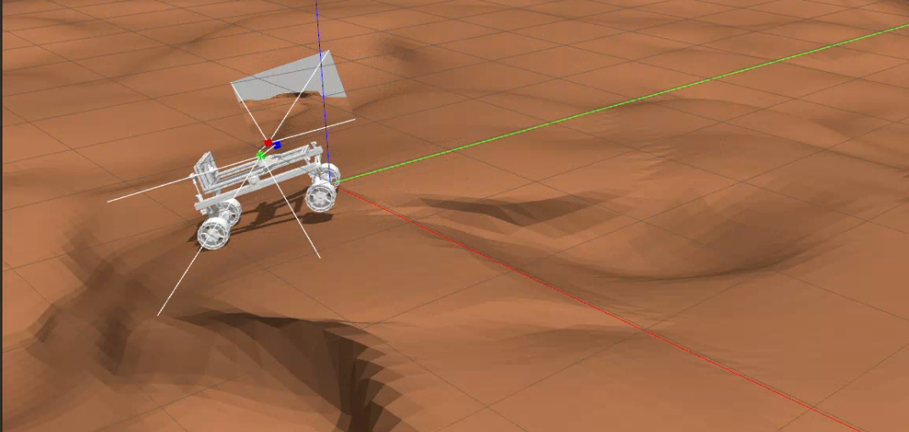

# Mars Rover Description Package

URDF model and Gazebo simulation files for the Mars Rover with swerve steering.

## Package Contents




## Quick Start

```bash
# Launch Gazebo simulation
roslaunch rover_description display.launch

# Launch RViz only
roslaunch rover_description description.launch
```

## Robot Structure


### Joint Types

| Joint | Type | Function |
|-------|------|----------|
| `steer1-4` | Revolute | Steering (±90°) |
| `wheel_1-4` | Continuous | Drive wheels |
| `camera_joint` | Fixed | Camera mount |
| `imu_joint` | Fixed | IMU sensor |

## Robot Specifications


| Parameter | Value |
|-----------|-------|
| **Wheelbase** | 0.853 m |
| **Track Width** | 0.591 m |
| **Wheel Radius** | 0.11 m |
| **Ground Clearance** | ~0.15 m |
| **Total Mass** | ~32 kg |

## Sensors


- **Camera:** Intel RealSense D435 (RGB-D)
  - Frame: `camera_link` → `camera_optical_link`
  - Position: Front, 0.2m forward
  
- **IMU:** 9-DOF Inertial Measurement Unit
  - Frame: `imu_link`
  - Position: Center of `base_link`

## Launch Files

### display.launch
Main simulation launcher with all components.

**Parameters:**
```bash
roslaunch rover_description display.launch \
  world_name:=<path_to_world> \
  gui:=true \
  paused:=false \
  verbose:=false
```
### description.launch
Robot state publisher only (no Gazebo).

```bash
roslaunch rover_description description.launch
```

## TF Tree


## Verify Installation

```bash
# Check URDF validity
check_urdf src/Mars-Rover/rover_description/urdf/rover_description.urdf

# Visualize TF tree
roslaunch rover_description description.launch
rosrun rqt_tf_tree rqt_tf_tree

# Check mesh paths
roscd rover_description
ls -lh meshes/

# View in RViz
roslaunch rover_description description.launch
rviz -d $(rospack find rover_description)/rviz/rviz_image.rviz
```


### Environment Setup

```bash
# Set Gazebo paths (add to ~/.bashrc)
export GAZEBO_MODEL_PATH=$GAZEBO_MODEL_PATH:$(rospack find rover_description)/..
export GAZEBO_RESOURCE_PATH=$GAZEBO_RESOURCE_PATH:$(rospack find rover_description)
export GAZEBO_MODEL_DATABASE_URI=""

Alternatively, update the mesh file paths in your URDF to use the ROS package path substitution:
```
$(find <package_name>)/meshes/<mesh_file>
```
This ensures the URDF can locate mesh files regardless of your workspace structure.

## File Structure

```
rover_description/
├── CMakeLists.txt
├── package.xml
├── Readme.md
├── urdf/
│   └── rover_description.urdf        # Main robot model
├── meshes/
│   ├── base_link.STL                 # Chassis mesh
│   ├── steering1-4.STL               # Steering assemblies
│   └── wheel1-4.STL                  # Wheel meshes
├── launch/
│   ├── display.launch                # Gazebo simulation
│   └── description.launch            # RViz visualization
├── worlds/
│   ├── clearpath_playpen.world       # Default world
│   ├── mars.world                    # Mars terrain
│   ├── mars2.world                   # Alternative Mars
│   └── terrain.world                 # Generated terrain
├── rviz/
│   └── rviz_image.rviz              # RViz config
└── config/
    └── (controller configs)          # If any
```


## Topics Published

| Topic | Type | Description |
|-------|------|-------------|
| `/joint_states` | sensor_msgs/JointState | All joint positions/velocities |
| `/tf` | tf2_msgs/TFMessage | Transform tree |
| `/gazebo/model_states` | gazebo_msgs/ModelStates | Gazebo model info |

## Integration

Works with:
- **rover_control:** Swerve steering controller
- **rover_navigation:** Navigation stack
- **rover_perception:** Sensor processing

```bash
# Full system launch
roslaunch rover_description display.launch
roslaunch rover_control control.launch
roslaunch rover_control teleop.launch
```

---

**Author:** Mars Rover Team  
**License:** BSD


