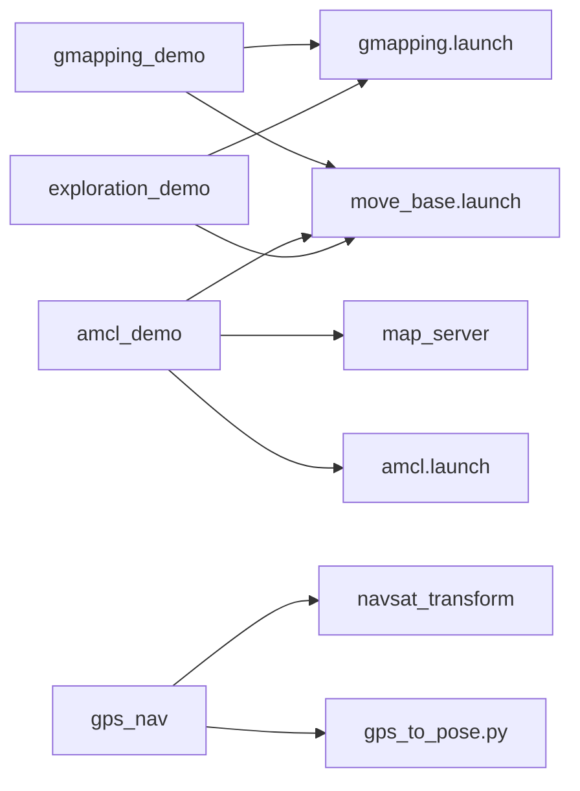
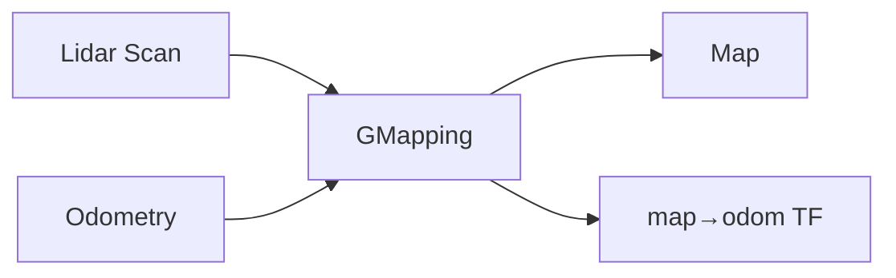
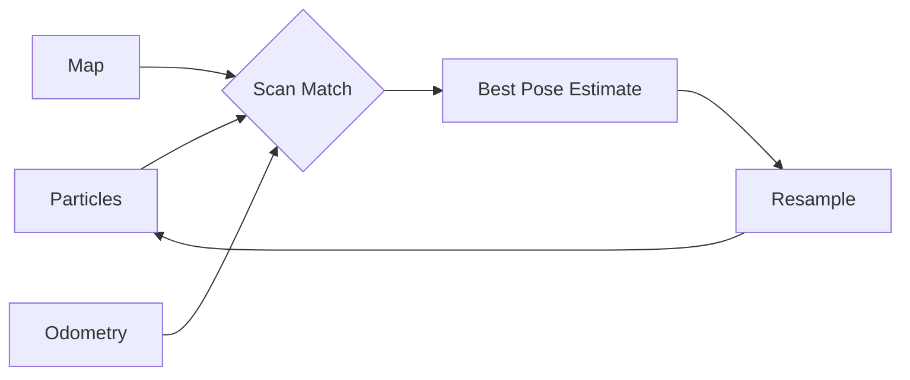
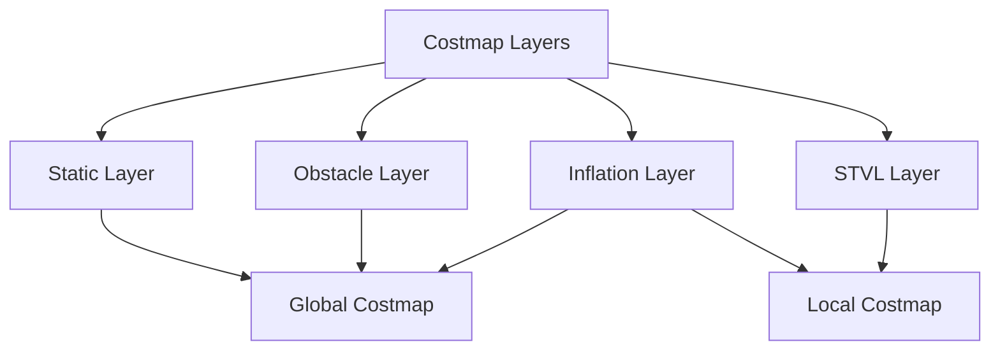
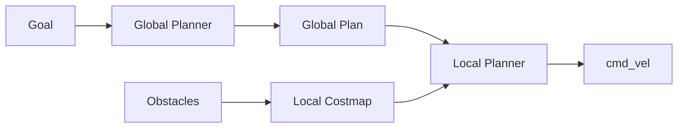
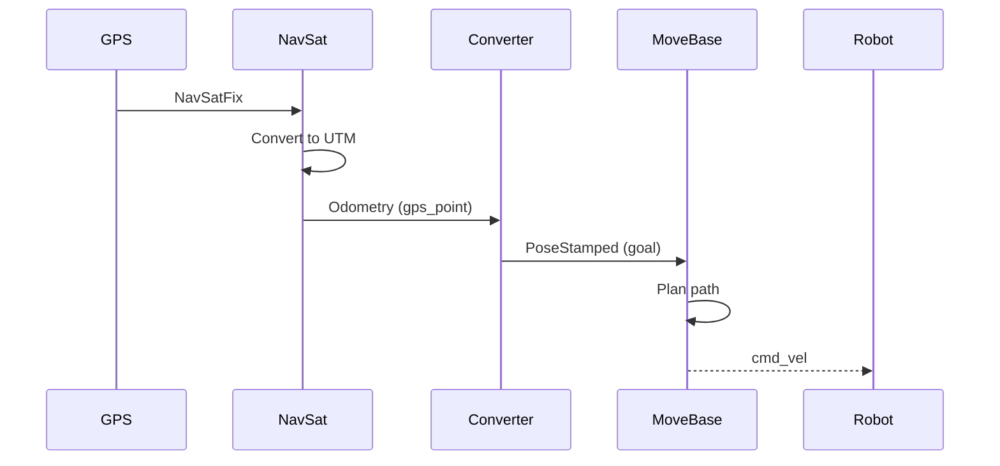
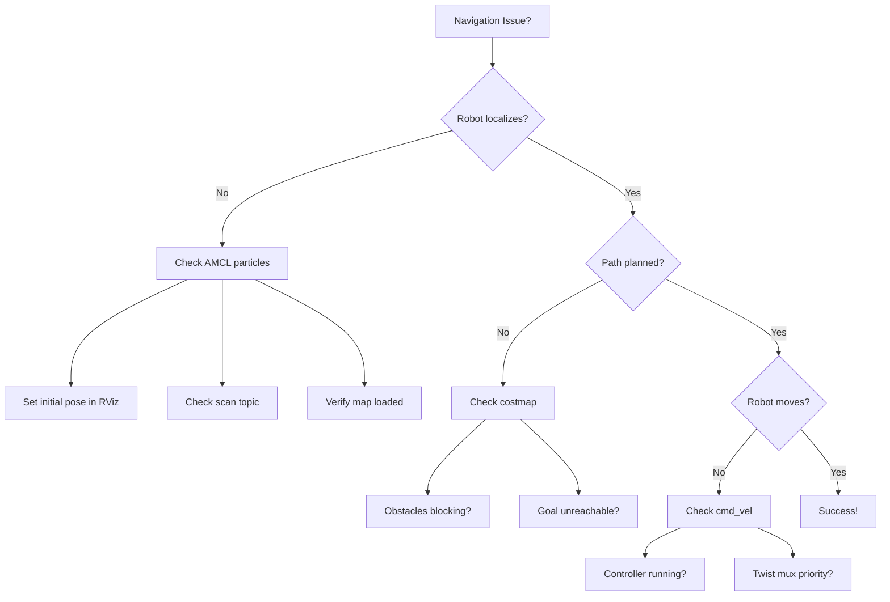

# Mars Rover Navigation Package

Navigation stack for autonomous Mars Rover with SLAM, localization, and path planning capabilities.

## Quick Start

```bash
# SLAM + Navigation
roslaunch rover_navigation gmapping_demo.launch

# Localization (with existing map)
roslaunch rover_navigation amcl_demo.launch

# GPS Waypoint Navigation
roslaunch rover_navigation gps_nav.launch
```

## System Architecture

```mermaid
graph TB
    subgraph Sensors
        A[Lidar] --> B[Scan Data]
        C[GPS] --> D[NavSatFix]
        E[Odometry] --> F[Odom Data]
    end
    
    subgraph SLAM
        B --> G[GMapping/SLAM Toolbox]
        G --> H[/map topic]
    end
    
    subgraph Localization
        H --> I[AMCL]
        B --> I
        F --> I
        I --> J[/amcl_pose]
    end
    
    subgraph Navigation
        H --> K[Move Base]
        J --> K
        B --> K
        K --> L[/cmd_vel]
    end
    
    subgraph GPS Nav
        D --> M[NavSat Transform]
        M --> N[GPS to Pose]
        N --> K
    end
```

## Launch Files



### Core Launch Files

| Launch File | Purpose | Use Case |
|------------|---------|----------|
| `gmapping_demo.launch` | SLAM + Navigation | **Mapping unknown terrain** |
| `amcl_demo.launch` | Localization + Navigation | **Navigate with existing map** |
| `exploration_demo.launch` | Autonomous exploration | **Auto-map environment** |
| `move_base_mapless_demo.launch` | Local navigation only | **Navigate without global map** |
| `gps_nav.launch` | GPS waypoint navigation | **Outdoor GPS navigation** |

## Configuration Files

### SLAM Configuration

**gmapping.launch** - GMapping SLAM parameters



| Parameter | Value | Description |
|-----------|-------|-------------|
| `maxUrange` | 5.5 m | Max usable laser range |
| `maxRange` | 6.1 m | Max sensor range |
| `particles` | 100 | Number of particles |
| `linearUpdate` | 0.3 m | Map update distance |
| `angularUpdate` | 0.5 rad | Map update angle |
| `delta` | 0.05 m | Map resolution |

**mapper_params_online_async.yaml** - SLAM Toolbox configuration

| Parameter | Value | Description |
|-----------|-------|-------------|
| `resolution` | 0.05 m | Map resolution |
| `max_laser_range` | 20.0 m | Max laser range |
| `minimum_travel_distance` | 0.5 m | Min distance for scan match |
| `minimum_travel_heading` | 0.5 rad | Min rotation for scan match |
| `do_loop_closing` | true | Enable loop closure |

### Localization Configuration

**amcl.launch** - Adaptive Monte Carlo Localization



| Parameter | Value | Description |
|-----------|-------|-------------|
| `min_particles` | 500 | Minimum particle filter size |
| `max_particles` | 2000 | Maximum particles |
| `laser_max_range` | 12.0 m | Max laser range for localization |
| `update_min_d` | 0.25 m | Min translation for update |
| `update_min_a` | 0.2 rad | Min rotation for update |
| `odom_model_type` | diff | Differential drive model |

### Costmap Configuration



#### Common Parameters (costmap_common.yaml)

| Parameter | Value | Description |
|-----------|-------|-------------|
| `footprint` | [[-0.5,-0.33], ...] | Robot footprint polygon |
| `update_frequency` | 4.0 Hz | Costmap update rate |
| `resolution` | 0.05 m | Costmap resolution |
| `obstacle_range` | 5.5 m | Max obstacle detection |
| `inflation_radius` | 0.5 m | Safety inflation radius |

#### Spatio-Temporal Voxel Layer (STVL)

3D obstacle detection using depth camera:

| Parameter | Value | Description |
|-----------|-------|-------------|
| `voxel_size` | 0.05 m | Voxel resolution |
| `voxel_decay` | 25.0 s | Obstacle decay time |
| `mark_threshold` | 0 | Min voxels for marking |
| `min_obstacle_height` | 0.5 m | Min obstacle height |
| `max_obstacle_height` | 2.0 m | Max obstacle height |

#### Costmap Types

**Global Costmap** (`costmap_global_static.yaml` / `costmap_global_laser.yaml`)
- Frame: `map`
- Rolling window: Depends on config
- Purpose: Long-term planning

**Local Costmap** (`costmap_local.yaml`)
- Frame: `map` (or `odom`)
- Rolling window: `true`
- Purpose: Obstacle avoidance

**Exploration Costmap** (`costmap_exploration.yaml`)
- Frontier detection
- Unknown space tracking
- Boundary exploration

## Navigation Stack



### Move Base Parameters

Located in launch file or separate config:

| Component | Algorithm | Purpose |
|-----------|-----------|---------|
| **Global Planner** | NavFn / Global Planner | A* path planning |
| **Local Planner** | DWA / TEB | Dynamic obstacle avoidance |
| **Recovery Behaviors** | Clear costmap, rotate | Get unstuck |

## GPS Navigation



### GPS Waypoint Navigation

**Usage:**
```bash
# Terminal 1: Start GPS navigation
roslaunch rover_navigation gps_nav.launch

# Terminal 2: Send GPS waypoint
rostopic pub /gps/input sensor_msgs/NavSatFix \
"header:
  frame_id: 'map'
latitude: 49.9000001088367
longitude: 8.90001
altitude: 0.0"
```

**Script:** `gps_to_pose.py`
- Subscribes: `/gps_point` (Odometry)
- Publishes: `/move_base_simple/goal` (PoseStamped)
- Converts GPS coordinates to navigation goals

## Topics

```mermaid
graph LR
    A[/front/scan] --> B[SLAM/Localization]
    C[/odom] --> B
    B --> D[/map]
    B --> E[/amcl_pose]
    
    F[/move_base_simple/goal] --> G[Move Base]
    D --> G
    E --> G
    G --> H[/cmd_vel]
    
    I[/gps/input] --> J[NavSat Transform]
    J --> K[/gps_point]
    K --> L[GPS to Pose]
    L --> F
```

### Key Topics

| Topic | Type | Description |
|-------|------|-------------|
| `/map` | nav_msgs/OccupancyGrid | Generated map |
| `/amcl_pose` | geometry_msgs/PoseWithCovarianceStamped | Robot pose |
| `/move_base/goal` | move_base_msgs/MoveBaseActionGoal | Navigation goal |
| `/move_base/global_costmap/costmap` | nav_msgs/OccupancyGrid | Global costmap |
| `/move_base/local_costmap/costmap` | nav_msgs/OccupancyGrid | Local costmap |
| `/front/scan` | sensor_msgs/LaserScan | Lidar data |
| `/camera/depth/points` | sensor_msgs/PointCloud2 | Depth camera |
| `/gps/input` | sensor_msgs/NavSatFix | GPS coordinates |

## Usage Examples

### 1. Create a Map

```bash
# Terminal 1: Launch SLAM
roslaunch rover_navigation gmapping_demo.launch

# Terminal 2: Control robot
roslaunch rover_control teleop.launch

# Terminal 3: Save map when done
rosrun map_server map_saver -f ~/maps/my_map
```

### 2. Navigate with Existing Map

```bash
# Edit amcl_demo.launch to use your map
# <arg name="map_file" default="$(find rover_navigation)/maps/my_map.yaml"/>

# Launch localization + navigation
roslaunch rover_navigation amcl_demo.launch

# Send goal via RViz: 2D Nav Goal tool
```

### 3. Autonomous Exploration

```bash
# Launch exploration (commented out by default)
roslaunch rover_navigation exploration_demo.launch

# Use RViz Publish Point to define exploration boundary
```

### 4. GPS Waypoint Navigation

```bash
# Terminal 1: Launch GPS navigation
roslaunch rover_navigation gps_nav.launch

# Terminal 2: Send GPS coordinates
rostopic pub /gps/input sensor_msgs/NavSatFix \
"{latitude: 49.9, longitude: 8.9, altitude: 0.0}"
```

## Monitoring and Debugging

### RViz Visualization

```bash
rosrun rviz rviz
```

**Add displays:**
- Map: `/map`
- LaserScan: `/front/scan`
- Path: `/move_base/NavfnROS/plan`
- Costmap: `/move_base/global_costmap/costmap`
- Robot Model
- TF

### Command Line Tools

```bash
# Check active nodes
rosnode list | grep -E "slam|amcl|move_base"

# Monitor map updates
rostopic hz /map

# Check localization
rostopic echo /amcl_pose

# View costmap
rosrun map_server map_saver -f /tmp/costmap map:=/move_base/global_costmap/costmap

# TF tree
rosrun tf view_frames
evince frames.pdf
```

## Troubleshooting



### Common Issues

| Issue | Symptoms | Solution |
|-------|----------|----------|
| **No localization** | AMCL particles scattered | Set initial pose in RViz (2D Pose Estimate) |
| **Poor map quality** | Distorted map | Improve odometry, reduce speed, tune SLAM params |
| **Robot stuck** | Won't move to goal | Check costmap for obstacles, adjust inflation |
| **Oscillation** | Robot wobbles | Tune local planner DWA params |
| **GPS not working** | No goal published | Check `robot_localization` EKF is running |
| **Path through obstacles** | Unsafe path | Increase `obstacle_range`, check sensor data |

### Parameter Tuning Guide

**For better localization:**
```yaml
# Increase particles
min_particles: 1000
max_particles: 5000

# More frequent updates
update_min_d: 0.1
update_min_a: 0.1
```

**For smoother navigation:**
```yaml
# Local planner (adjust in move_base params)
max_vel_x: 0.5  # Reduce max speed
min_vel_x: 0.1  # Set minimum forward velocity
```

**For tighter obstacle avoidance:**
```yaml
# Costmap
inflation_radius: 0.3  # Reduce inflation
obstacle_range: 3.0    # Closer detection
```

## File Structure

```
rover_navigation/
├── config/
│   ├── costmap_common.yaml           # Shared costmap params
│   ├── costmap_local.yaml            # Local costmap
│   ├── costmap_global_static.yaml    # Static global costmap
│   ├── costmap_global_laser.yaml     # Dynamic global costmap
│   ├── costmap_exploration.yaml      # Exploration costmap
│   └── mapper_params_online_async.yaml # SLAM Toolbox config
├── launch/
│   ├── gmapping_demo.launch          # SLAM + navigation
│   ├── gmapping.launch               # SLAM only
│   ├── amcl_demo.launch              # Localization + navigation
│   ├── amcl.launch                   # Localization only
│   ├── move_base.launch              # Navigation stack
│   ├── exploration_demo.launch       # Autonomous exploration
│   ├── exploration.launch            # Exploration config
│   ├── gps_nav.launch                # GPS navigation
│   ├── slam.launch                   # SLAM Toolbox
│   └── move_base_mapless_demo.launch # No map navigation
├── maps/
│   ├── playpen_map.yaml              # Example map metadata
│   └── playpen_map.pgm               # Example map image
├── scripts/
│   ├── gps_to_pose.py                # GPS waypoint converter
│   └── commad_file.yml               # Example GPS command
└── Readme.md
```

## Dependencies

```xml
<depend>move_base</depend>
<depend>gmapping</depend>
<depend>amcl</depend>
<depend>map_server</depend>
<depend>slam_toolbox</depend>
<depend>robot_localization</depend>
<depend>frontier_exploration</depend>
<depend>spatio_temporal_voxel_layer</depend>
<depend>costmap_2d</depend>
<depend>nav_core</depend>
```

Install missing packages:
```bash
sudo apt install ros-noetic-navigation \
                 ros-noetic-gmapping \
                 ros-noetic-slam-toolbox \
                 ros-noetic-robot-localization \
                 ros-noetic-spatio-temporal-voxel-layer
```

## Integration

Works with:
- **rover_description:** Robot URDF and sensors
- **rover_control:** Swerve steering controller
- **rover_perception:** Camera and lidar processing

**Full system launch:**
```bash
# Terminal 1: Simulation + Control
roslaunch rover_description display.launch
roslaunch rover_control control.launch

# Terminal 2: Navigation
roslaunch rover_navigation gmapping_demo.launch

# Terminal 3: Teleop
roslaunch rover_control teleop.launch
```

## Performance Tips

- **CPU Usage:** Reduce particle count or map resolution for slower systems
- **Map Size:** Limit `xmin/xmax/ymin/ymax` in GMapping for known areas
- **Update Rates:** Lower `update_frequency` if CPU constrained
- **Sensor Range:** Match `maxUrange` to actual sensor capabilities

---

**Author:** Mars Rover Team  
**License:** BSD  
**ROS Version:** Noetic